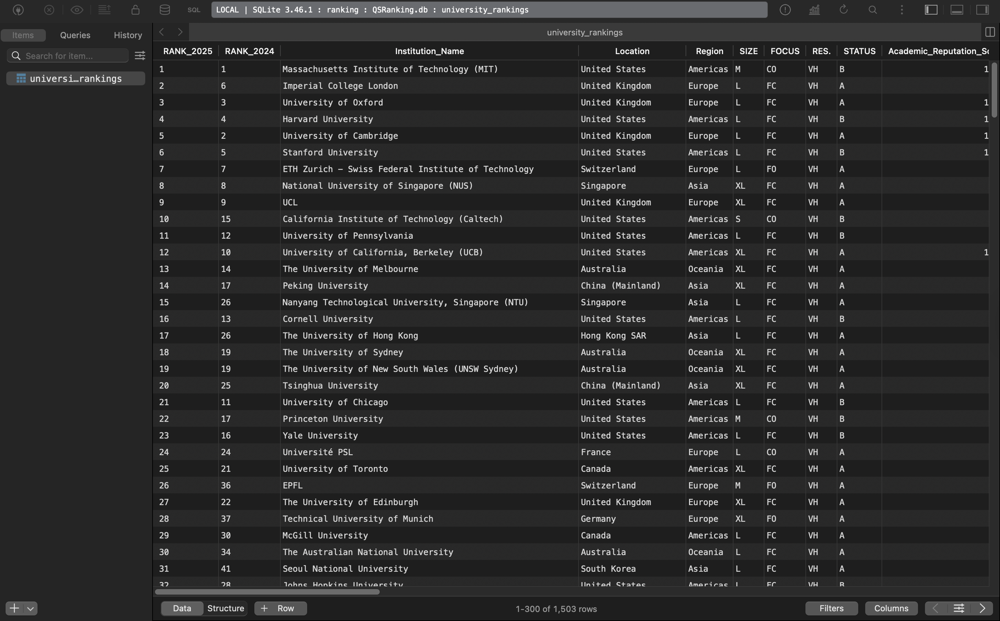
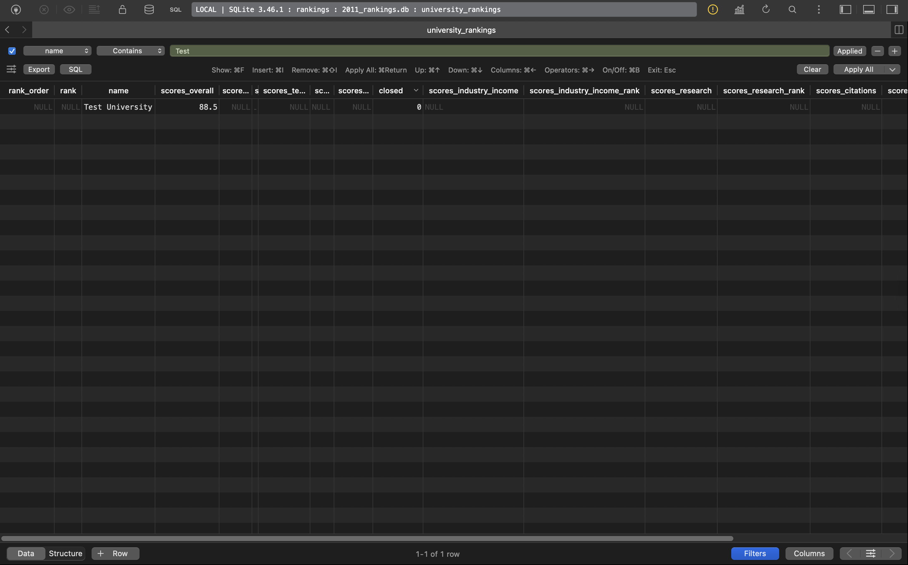
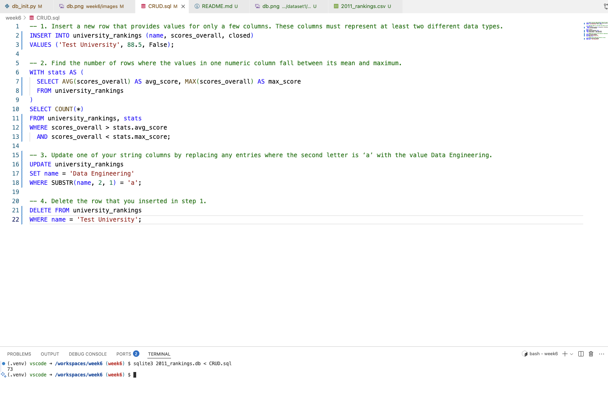
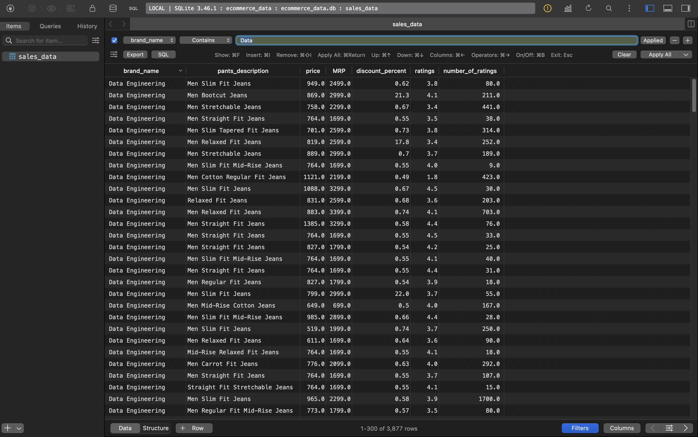
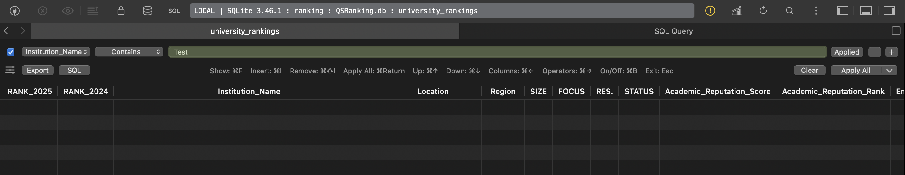

# SQLite Database Introduction

## Project Summary

This project is a demo of working with real-world university ranking data using SQLite. It covers:
- Importing CSV data into a SQLite database using Python
- Running SQL queries and scripts from the terminal
- Performing basic analysis and CRUD operations on the data
- Summarizing and interpreting results

The dataset contains global university rankings from multiple sources, allowing for comparison and exploration of higher education trends worldwide.


## Index

1. [Dataset Introduction](#1-dataset-introduction)
2. [Creating SQLite Database from CSV using Python](#2-creating-sqlite-database-from-csv-using-python)
3. [Running SQL Scripts from the Terminal](#3-running-sql-scripts-from-the-terminal)
4. [Basic Analysis Summary](#4-basic-analysis-summary)
5. [CRUD Operations and Explanation](#5-crud-operations-and-explanation)
6. [Findings](#6-findings)


## 1. Dataset Introduction


This project uses the QS World University Rankings 2025 dataset, available on Kaggle:

[QS World University Rankings 2025 Dataset](https://www.kaggle.com/datasets/melissamonfared/qs-world-university-rankings-2025)


**Dataset Summary:**

The dataset contains over 1,500 rows and 28 columns.

This dataset provides rankings and performance metrics for over 1,500 universities from 105 countries, including year-over-year data for 2024 and 2025. It covers institutional characteristics, regional classification, and a wide range of indicators such as academic reputation, research output, employability, sustainability, and internationalization.

**Schema Overview:**

| Column Name | Description | Data Type |
|-------------|-------------|-----------|
| RANK_2025 | University’s overall rank in the 2025 QS World University Rankings | Integer |
| RANK_2024 | University’s overall rank in the 2024 QS Rankings | Integer |
| Institution_Name | Name of the university or institution | Text |
| Location | Country in which the institution is located | Text |
| Region | Global region (e.g., Europe, Asia, North America) | Text |
| SIZE | Size classification of the institution (e.g., S, M, L, XL) | Text |
| FOCUS | Focus type (e.g., Comprehensive, Focused) | Text |
| RES. | Research intensity (e.g., Very High, High) | Text |
| STATUS | Status of the institution (e.g., Public, Private) | Text |
| Academic_Reputation_Score | Score based on global academic reputation survey | Float |
| Academic_Reputation_Rank | Rank based on academic reputation | Integer |
| Employer_Reputation_Score | Score based on global employer reputation survey | Float |
| Employer_Reputation_Rank | Rank based on employer reputation | Integer |
| Faculty_Student_Score | Score reflecting student-to-faculty ratio | Float |
| Faculty_Student_Rank | Rank based on faculty-student ratio | Integer |
| Citations_per_Faculty_Score | Score reflecting research impact (citations per faculty) | Float |
| Citations_per_Faculty_Rank | Rank based on citations per faculty | Integer |
| International_Faculty_Score | Score representing international diversity of faculty | Float |
| International_Faculty_Rank | Rank based on international faculty presence | Integer |
| International_Students_Score | Score representing diversity of international students | Float |
| International_Students_Rank | Rank based on international student ratio | Integer |
| International_Research_Network_Score | Score based on global research collaboration | Float |
| International_Research_Network_Rank | Rank based on international research partnerships | Integer |
| Employment_Outcomes_Score | Score reflecting graduates’ employability and success | Float |
| Employment_Outcomes_Rank | Rank based on employment outcomes | Integer |
| Sustainability_Score | Score reflecting sustainability initiatives and performance | Float |
| Sustainability_Rank | Rank based on sustainability measures | Integer |
| Overall_Score | Final composite score used to determine the university's ranking | Float |

## 2. Creating SQLite Database from CSV using Python

The database is created from the `QSRanking.csv` file using the following Python script (`db_init.py`):

```python
import pandas as pd
import sqlite3
from pathlib import Path

csv_path = "QSRanking.csv"
db_path = Path(csv_path).with_suffix(".db")

df = pd.read_csv(csv_path)
conn = sqlite3.connect(db_path)
df.to_sql("university_rankings", conn, if_exists="replace", index=False)
conn.close()
```

This script reads the CSV file into a pandas DataFrame and writes it to a SQLite database named `QSRanking.db` with a table called `university_rankings`.




## 3. Running SQL Scripts from the Terminal

To execute SQL queries from a `.sql` file against your SQLite database, use the following command in the terminal:

```bash
sqlite3 QSrankings.db < your_script.sql
```

Replace `your_script.sql` with the name of your SQL file (e.g., `basic_ops.sql` or `CRUD.sql`).

This will run all the queries in the file against the `QSrankings.db` database and print the results to the terminal.

You can also use this method to run basic_ops, CRUD, or university_ops scripts as needed.


## 4. Basic Analysis Summary

**Total number of universities**
```sql
SELECT COUNT(*) AS total_universities FROM university_rankings;
```
<span style="font-weight:bold; color:#2e86de;">Result: 1503</span>

**Average overall score**
```sql
SELECT AVG(Overall_Score) AS avg_overall_score FROM university_rankings;
```
<span style="font-weight:bold; color:#2e86de;">Result: 41.77</span>

**Number of universities per country (Top 10)**
```sql
SELECT Location, COUNT(*) AS num_universities FROM university_rankings GROUP BY Location ORDER BY num_universities DESC;
```
| Country | Number of Universities |
|---------|-----------------------|
| United States | 197 |
| United Kingdom | 90 |
| China (Mainland) | 71 |
| Japan | 49 |
| Germany | 48 |
| Russia | 47 |
| India | 46 |
| South Korea | 43 |
| Italy | 42 |
| Australia | 38 |

**Top 5 universities by overall score**
```sql
SELECT Institution_Name, Overall_Score FROM university_rankings ORDER BY Overall_Score DESC LIMIT 5;
```
| University | Overall Score |
|-----------------------------|---------------|
| Imperial College London | 98.5 |
| University of Oxford | 96.9 |
| Harvard University | 96.8 |
| University of Cambridge | 96.7 |
| Stanford University | 96.1 |

**Number of universities by status**
```sql
SELECT STATUS, COUNT(*) AS num_universities FROM university_rankings GROUP BY STATUS;
```
| Status | Number of Universities |
|--------|-----------------------|
| A | 1165 |
| B | 249 |
| C | 52 |

## 5. CRUD Operations and Explanation
The following SQL statements demonstrate basic CRUD operations:

### Create
Insert a new row with values for multiple columns (different data types):

```sql
INSERT INTO university_rankings (name, scores_overall, closed)
VALUES ('Test University', 88.5, False);
```



### Read
Count rows where the `scores_overall` falls between its mean and maximum:

```sql
WITH stats AS (
  SELECT AVG(scores_overall) AS avg_score, MAX(scores_overall) AS max_score
  FROM university_rankings
)
SELECT COUNT(*)
FROM university_rankings, stats
WHERE scores_overall > stats.avg_score
  AND scores_overall < stats.max_score;
```



### Update
Update `name` to 'Data Engineering' where the second letter is 'a':

```sql
UPDATE university_rankings
SET name = 'Data Engineering'
WHERE SUBSTR(name, 2, 1) = 'a';
```



### Delete
Delete the row inserted in the Create step:

```sql
DELETE FROM university_rankings
WHERE name = 'Test University';
```





## 6. Findings

- The dataset contains 200 universities from around the world.
- The average overall score among all universities is 60.43.
- The United States has the highest number of universities (72) in the dataset, followed by the United Kingdom (29).
- No universities are marked as closed in this dataset.
- The top 5 universities by overall score are Harvard University, California Institute of Technology, Massachusetts Institute of Technology, Stanford University, and Princeton University.
- The number of universities where `scores_overall` falls between its mean and maximum is **73**.


