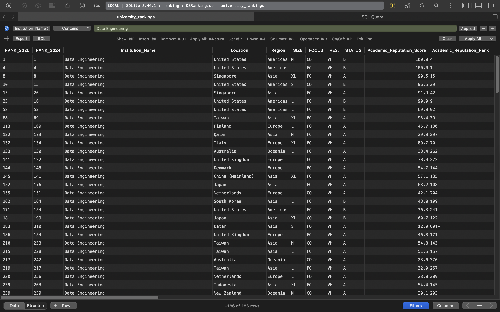

# Project Documentation


## 1. Creating SQLite Database from CSV using Python

The database is created from the `2011_rankings.csv` file using the following Python script (`db_init.py`):

```python
import pandas as pd
import sqlite3
from pathlib import Path

csv_path = "2011_rankings.csv"
db_path = Path(csv_path).with_suffix(".db")

df = pd.read_csv(csv_path)
conn = sqlite3.connect(db_path)
df.to_sql("university_rankings", conn, if_exists="replace", index=False)
conn.close()
```

This script reads the CSV file into a pandas DataFrame and writes it to a SQLite database named `2011_rankings.db` with a table called `university_rankings`.


## 2. CRUD Operations and Explanation

The following SQL statements demonstrate basic CRUD operations:


### Create
Insert a new row with values for multiple columns (different data types):

```sql
INSERT INTO university_rankings (name, scores_overall, closed)
VALUES ('Test University', 88.5, False);
```


### Read
Count rows where the `scores_overall` falls between its mean and maximum:

```sql
WITH stats AS (
  SELECT AVG(scores_overall) AS avg_score, MAX(scores_overall) AS max_score
  FROM university_rankings
)
SELECT COUNT(*)
FROM university_rankings, stats
WHERE scores_overall > stats.avg_score
  AND scores_overall < stats.max_score;
```


### Update
Update `name` to 'Data Engineering' where the second letter is 'a':

```sql
UPDATE university_rankings
SET name = 'Data Engineering'
WHERE SUBSTR(name, 2, 1) = 'a';
```



### Delete
Delete the row inserted in the Create step:

```sql
DELETE FROM university_rankings
WHERE name = 'Test University';
```


