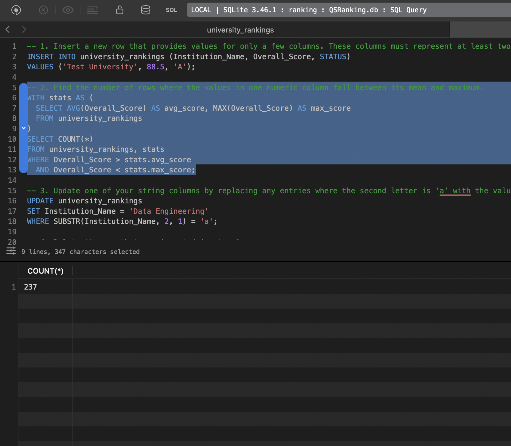

# SQLite Database Introduction

## Index

1. [Creating SQLite Database from CSV using Python](#1-creating-sqlite-database-from-csv-using-python)
2. [Running SQL Scripts from the Terminal](#2-running-sql-scripts-from-the-terminal)
3. [Basic Analysis Summary](#3-basic-analysis-summary)
4. [CRUD Operations and Explanation](#4-crud-operations-and-explanation)
5. [Findings](#5-findings)


## 1. Creating SQLite Database from CSV using Python

The database is created from the `2011_rankings.csv` file using the following Python script (`db_init.py`):

```python
import pandas as pd
import sqlite3
from pathlib import Path

csv_path = "2011_rankings.csv"
db_path = Path(csv_path).with_suffix(".db")

df = pd.read_csv(csv_path)
conn = sqlite3.connect(db_path)
df.to_sql("university_rankings", conn, if_exists="replace", index=False)
conn.close()
```

This script reads the CSV file into a pandas DataFrame and writes it to a SQLite database named `2011_rankings.db` with a table called `university_rankings`.


## 2. Running SQL Scripts from the Terminal

To execute SQL queries from a `.sql` file against your SQLite database, use the following command in the terminal:

```bash
sqlite3 2011_rankings.db < your_script.sql
```

Replace `your_script.sql` with the name of your SQL file (e.g., `basic_ops.sql` or `CRUD.sql`).

This will run all the queries in the file against the `2011_rankings.db` database and print the results to the terminal.

You can also use this method to run basics_ops, CRUD, or university_ops scripts as needed.

## 3. Basic Analysis Summary

**Total number of universities**
```sql
SELECT COUNT(*) AS total_universities FROM university_rankings;
```
<span style="font-weight:bold; color:#2e86de;">Result: 200</span>

**Average overall score**
```sql
SELECT AVG(scores_overall) AS avg_overall_score FROM university_rankings;
```
<span style="font-weight:bold; color:#2e86de;">Result: 60.43</span>

**Number of closed universities**
```sql
SELECT COUNT(*) AS closed_universities FROM university_rankings WHERE closed = 1;
```
<span style="font-weight:bold; color:#2e86de;">Result: 0</span>


**Number of universities per country (Top 10)**
```sql
SELECT location, COUNT(*) AS num_universities FROM university_rankings GROUP BY location ORDER BY num_universities DESC;
```
| Country | Number of Universities |
|---------|-----------------------|
| United States | 72 |
| United Kingdom | 29 |
| Germany | 14 |
| Netherlands | 10 |
| Canada | 9 |
| Australia | 7 |
| Switzerland | 6 |
| Sweden | 6 |
| China | 6 |
| Japan | 5 |


**Top 5 universities by overall score**
```sql
SELECT name, scores_overall FROM university_rankings ORDER BY scores_overall DESC LIMIT 5;
```
| University | Overall Score |
|------------|---------------|
| Harvard University | 96.1 |
| California Institute of Technology | 96.0 |
| Massachusetts Institute of Technology | 95.6 |
| Stanford University | 94.3 |
| Princeton University | 94.2 |

## 4. CRUD Operations and Explanation
The following SQL statements demonstrate basic CRUD operations:

### Create
Insert a new row with values for multiple columns (different data types):

```sql
INSERT INTO university_rankings (name, scores_overall, closed)
VALUES ('Test University', 88.5, False);
```


### Read
Count rows where the `scores_overall` falls between its mean and maximum:

```sql
WITH stats AS (
  SELECT AVG(scores_overall) AS avg_score, MAX(scores_overall) AS max_score
  FROM university_rankings
)
SELECT COUNT(*)
FROM university_rankings, stats
WHERE scores_overall > stats.avg_score
  AND scores_overall < stats.max_score;
```



### Update
Update `name` to 'Data Engineering' where the second letter is 'a':

```sql
UPDATE university_rankings
SET name = 'Data Engineering'
WHERE SUBSTR(name, 2, 1) = 'a';
```


### Delete
Delete the row inserted in the Create step:

```sql
DELETE FROM university_rankings
WHERE name = 'Test University';
```


## 5. Findings

Based on the analysis:

- The dataset contains 200 universities from around the world.
- The average overall score among all universities is 60.43.
- The United States has the highest number of universities (72) in the dataset, followed by the United Kingdom (29).
- No universities are marked as closed in this dataset.
- The top 5 universities by overall score are Harvard University, California Institute of Technology, Massachusetts Institute of Technology, Stanford University, and Princeton University.
- The number of universities where `scores_overall` falls between its mean and maximum is **73**.


