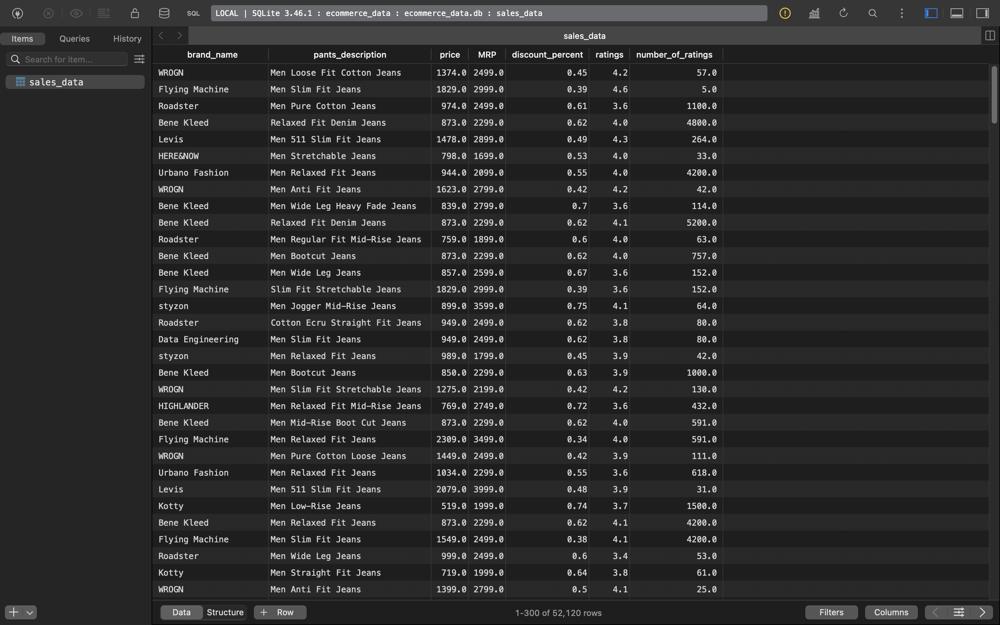
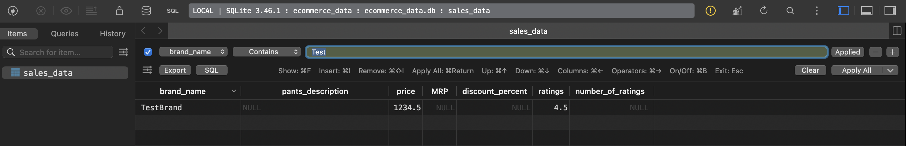
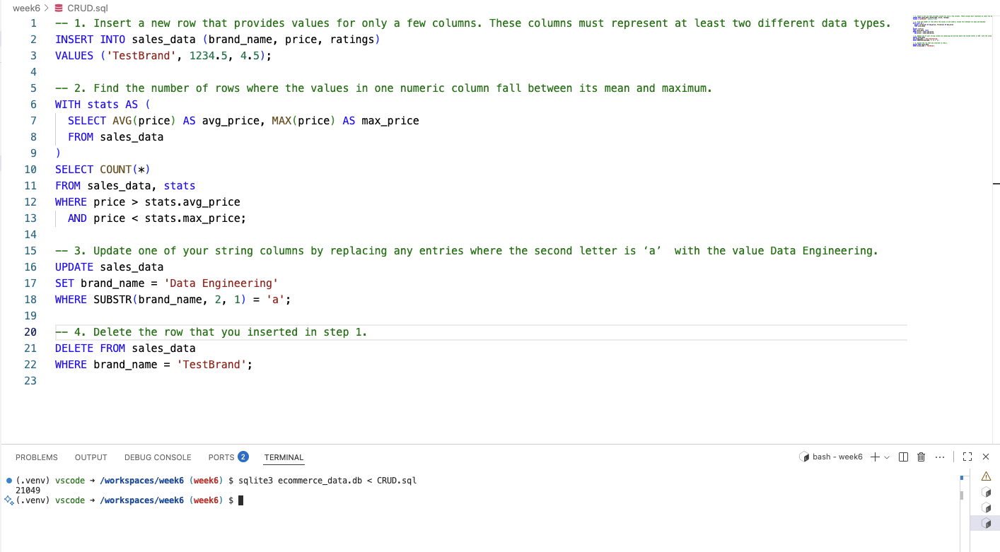
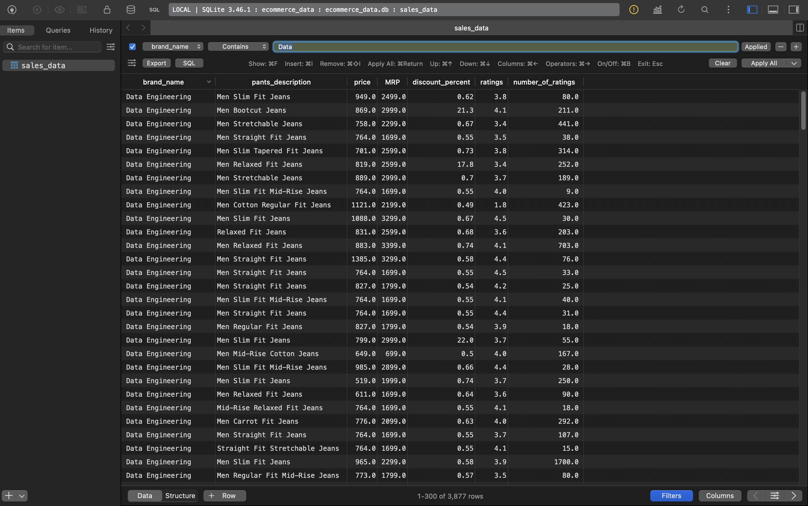
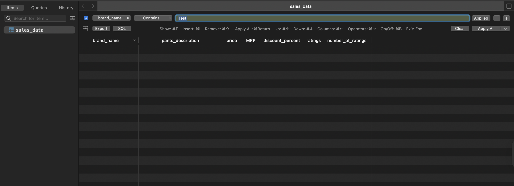

# Project Documentation

## 1. Creating SQLite Database from CSV using Python

The database is created from the `ecommerce_data.csv` file using the following Python script (`db_init.py`):

```python
import pandas as pd
import sqlite3
from pathlib import Path

csv_path = "ecommerce_data.csv"
db_path = Path(csv_path).with_suffix(".db")

df = pd.read_csv(csv_path)
conn = sqlite3.connect(db_path)
df.to_sql("sales_data", conn, if_exists="replace", index=False)
conn.close()
```

This script reads the CSV file into a pandas DataFrame and writes it to a SQLite database named `ecommerce_data.db` with a table called `sales_data`.



## 2. CRUD Operations and Explanation

The following SQL statements demonstrate basic CRUD operations:

### Create
Insert a new row with values for multiple columns (different data types):

```sql
INSERT INTO sales_data (brand_name, price, ratings)
VALUES ('TestBrand', 1234.5, 4.5);
```



### Read
Count rows where the `price` falls between its mean and maximum:

```sql
WITH stats AS (
	SELECT AVG(price) AS avg_price, MAX(price) AS max_price
	FROM sales_data
)
SELECT COUNT(*)
FROM sales_data, stats
WHERE price > stats.avg_price
	AND price < stats.max_price;
```



### Update
Update `brand_name` to 'Data Engineering' where the second letter is 'a':

```sql
UPDATE sales_data
SET brand_name = 'Data Engineering'
WHERE SUBSTR(brand_name, 2, 1) = 'a';
```



### Delete
Delete the row inserted in the Create step:

```sql
DELETE FROM sales_data
WHERE brand_name = 'TestBrand';
```



